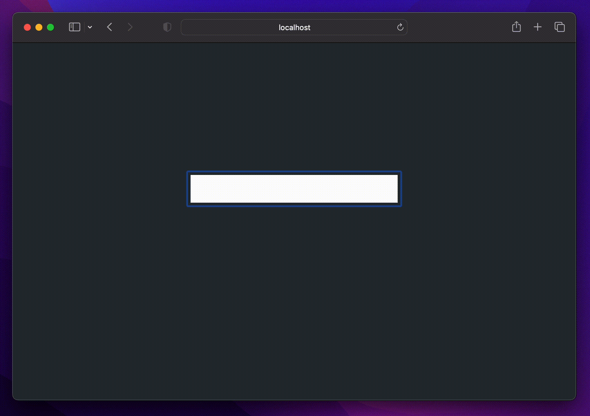

# validatorus-react
[](https://github.com/cryshado/validatorus-react/blob/main/LICENSE) [](https://www.typescriptlang.org/)

ReactJS lightweight field validator



# install
`yarn add validatorus-react` or `npm install validatorus-react`

# example
```tsx
export const App: React.FC = () => {
    const input = new VldBuilder()
        .with(vlds.VLen, 0, 5)
        .withFname('Name')

    return (
        <div className="App">
            <header className="App-header">
                <input
                    type="text"
                    value={input.value}
                    onChange={(e) => {
                        input.change(e.target.value)
                        console.log(e.target.value)
                    }}
                />
                <p>{input.error}</p>
            </header>
        </div>
    )
}
```

# license
MIT license. Read more in [LICENSE](./LICENSE) file.
